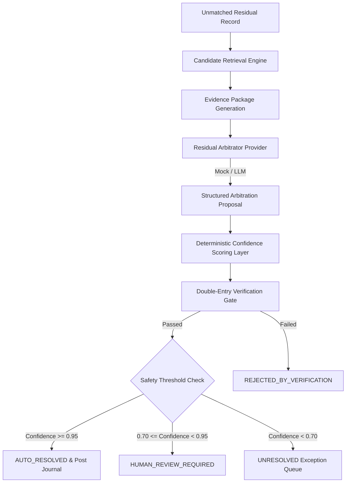

# Phase 2: Residual AI Arbitrator

ReconGuard’s residual AI arbitrator operates on unmatched transactions (**residuals**) left behind after deterministic rules run.

The core architectural principle of ReconGuard is:

> **Deterministic first. AI second. Human when uncertain.**

---

## Key Principles & Guardrails

1. **AI Never Overrides Deterministic Engine**: The AI arbitrator is invoked **only** on unresolved residual records. It is never invoked on matched records and cannot overturn a deterministic match.
2. **Zero Hallucinated Money**: The AI model evaluates confidence and produces reasoning, but **never invents monetary amounts or dates**. All financial amounts are derived strictly from deterministic retrieval of source records.
3. **Evidence-First Hybrid Confidence**: Final confidence is computed using a weighted formula:
   $$\text{Final Confidence} = 0.80 \times \text{Evidence Score} + 0.20 \times \text{Model Confidence}$$
   Model confidence is capped at **0.90** to prevent ungrounded LLM overconfidence.
4. **Double-Entry Verification Gate**: Every proposal must pass accounting balance checks ($\text{Debits} = \text{Credits}$) and line-item matching before it can be accepted.
5. **Safety Thresholds**:
   - $\text{Final Confidence} \ge 0.95 \implies \text{AUTO\_RESOLVED}$
   - $0.70 \le \text{Final Confidence} < 0.95 \implies \text{HUMAN\_REVIEW\_REQUIRED}$
   - $\text{Final Confidence} < 0.70 \implies \text{UNRESOLVED}$

---

## System Architecture



---

## 1. Candidate Retrieval & Evidence Packaging

For each residual record, candidate counterparty records (orders, payments, invoices, bank credits) are retrieved across three channels:
- **Identifier Similarity**: Exact & alias matches (e.g. token similarity, reference typos).
- **Amount Proximity**: Exact amount match or minor variance.
- **Value Date Proximity**: Dates within standard settlement windows.

The evidence score is calculated as:
$$\text{Evidence Score} = w_{\text{id}} \cdot S_{\text{id}} + w_{\text{amount}} \cdot S_{\text{amount}} + w_{\text{date}} \cdot S_{\text{date}} + w_{\text{counterparty}} \cdot S_{\text{counterparty}}$$

---

## 2. Arbitrator Implementations

ReconGuard provides two modular implementations of the `ResidualArbitrator` interface:

1. **`MockResidualArbitrator`**:
   - Ideal for synthetic anomaly benchmarking, local dev, and CI test suites without external API keys.
   - Evaluates synthetic anomaly patterns:
     - `ROUNDING_ERROR`: Small variance ($\le 100$ paisa).
     - `INVOICE_TYPO`: Typo in invoice reference string.
     - `CUSTOMER_ALIAS`: Known customer trading name variations.
     - `UNKNOWN_BANK_CREDIT`: Unidentified credit entries matched to pending receivables.

2. **`LLMResidualArbitrator`**:
   - Integrates with Gemini / OpenAI / Anthropic via structured JSON prompt schemas.
   - Enforces fallback to `DeterministicArbitrator` / `NullArbitrator` if API key is unconfigured or model call fails.
   - Returns structured `ArbitrationResult` with metadata, reasoning, proposed action, and confidence.

---

## 3. Human Review & Auditability

Residual items requiring review are placed in the **Proposals Queue** in the UI:
- **Evidence Drawer**: Clicking a residual opens a detailed drawer displaying the full evidence package, component scores, model score, verification gate status, and exception banner.
- **Human Review Actions**:
  - `Approve`: Approves the proposal, marks decision as `ACCEPTED`, and posts double-entry journal entries.
  - `Reject`: Rejects proposal and keeps residual as exception.
  - `Mark Unresolved`: Resets residual to unresolved queue for manual intervention.
- **Audit Logging**: Every action emits an immutable `AuditEvent` recording actor, previous/new state, calculation details, and evidence links.

---

## 4. Ground-Truth Evaluation Harness

ReconGuard includes an automated evaluation harness (`app/services/ai/evaluation.py` and `scripts/evaluate_ai.py`) to measure arbitrator accuracy against ground-truth synthetic labels:

- **Metrics Calculated**:
  - **Precision**: $\frac{\text{TP}}{\text{TP} + \text{FP}}$
  - **Recall**: $\frac{\text{TP}}{\text{TP} + \text{FN}}$
  - **F1 Score**: $2 \cdot \frac{\text{Precision} \cdot \text{Recall}}{\text{Precision} + \text{Recall}}$
  - **Accuracy**: $\frac{\text{TP} + \text{TN}}{\text{Total}}$
  - **Coverage**: Proportion of residuals with non-zero resolution proposal.
  - **Overrides Prevented**: Count of incorrect model proposals blocked by the verification gate.

---

## 5. API Endpoints

| Endpoint | Method | Description |
| :--- | :--- | :--- |
| `/api/arbitration/run` | `POST` | Arbitrate all residuals in active run |
| `/api/arbitration/run/{run_id}` | `POST` | Arbitrate residuals for specific run ID |
| `/api/arbitration/results` | `GET` | List arbitration results and summary |
| `/api/arbitration/results/{residual_id}` | `GET` | Fetch detail & breakdown for single residual |
| `/api/arbitration/{residual_id}/approve` | `POST` | Approve proposal & post journal entry |
| `/api/arbitration/{residual_id}/reject` | `POST` | Reject proposal |
| `/api/arbitration/{residual_id}/unresolve` | `POST` | Reset residual to unresolved |
| `/api/arbitration/evaluate/{run_id}` | `GET` | Run ground-truth evaluation metrics |
| `/api/arbitration/metrics/{run_id}` | `GET` | Get AI utilization & cost summary |

---

## 6. Running Evaluation from CLI

To execute the ground-truth evaluation harness from terminal:

```bash
/tmp/recon_venv/bin/python backend/scripts/evaluate_ai.py --provider mock
```
